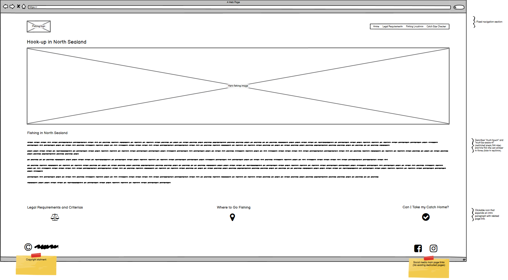

# Hook-up in North Sealand

[View the live project here.](https://axel713.github.io/hook-up-in-north-sealand/)

Hook-up in North Sealand is a new project, directed primarly to foreigners living in Denmark or tourists who want to take part or begin to discover fishing in the country.

The overall goal is to give its audience a reconciliation of the basic necessary information which is most often scattered accross various danish sites.

As a new fisherman, I also intend to give some field functionality that help users with following some of the exisiting rules.

## Content

-   [UX](#UX)
    -   [User Goals](#User-Goals)
    -   [User Stories](#User-Stories)
    -   [Site Owner Goals](#Site-Owner-Goals)
    -   [User Requirements and Expectations](#User-Requirements-and-Expectations)
    -   [Design Choices](#Design-Choices)
        -   [Colours](#Colours)
        -   [Fonts](#Fonts)
        -   [Wireframes](#Wireframes)
-   [Features](#Features)
    -   [Existing Features](#Existing-Features)
    -   [Future Features](#Future-Features)
-   [Technologies Used](#Technologies-Used)
    -   [Languages](#Languages)
    -   [Libraries](#Libraries)
    -   [Tools](#Tools)
-   [Testing](#Testing)
    -   [User stories testing](#User-stories-testing)
    -   [HMTL code validation](#HTML-code-validation)
    -   [CSS code validation](#CSS-code-validation)
    -   [JS code validation](#JS-code-validation)
    -   [Overall website test](#Overall-website-test)
        -   [Google Lighthouse](#Google-Lighthouse)
    -   [Responsiveness](#Responsiveness)
    -   [Social media link](#Social-media-link)
    -   [JavaScript functions](#JavaScript-functions)
        -   [initMap](#initMap)
        -   [fishTest](#fishTest)
    -   [Bugs and fixes](#Bugs-and-fixes)
        -   [HMTL fixes](#HMTL-fixes)
        -   [CSS sixes](#CSS-fixes)
        -   [JavaScript fixes](#JavaScript-fixes)
-   [Deployment](#Deployment)
    -   [GitHub Pages](#GitHub-Pages)
    -   [Local deployment](#Local-deployment)
-   [Credits](#Credits)
    -   [Project Content](#Project-Content)
    -   [Media](#Media)
    -   [Acknowledgements](#Acknowledgements)

---

## **UX**

User profiles are expected to be very varied. Being mainly targeted to foreigners in Denmark and tourists, variations in culture, background, age range make it difficult to pinpoint a/some specific groups. Nonetheless, to fit the current scandinavic design trends and be easy to use (especially in the field) the new UX must be:

-   with a simple and clear layout.
-   with a colour theme blending sea, nature and the Danish location. It also must be "easy on the eye" especially during levels of low light conditons, since the best fishing times tend to be at dusk/dawn.

### **User Goals**

-   **Know where** I can find essential legal information for fishing in Denmark.
-   **Know where** I can purchase a fishing licence.
-   **Be aware** of environmental considerations.
-   **Find out** some examples of where I can go fishing.
-   **Know if** I can keep the fish that I catch.
-   **Access** social media.

### **User Stories**

-   As a user, I want to know where I can find essential legal information for fishing in Denmark.
-   As a user, I want to know where I can purchase a fishing licence.
-   As a user, I want to be aware of environmental considerations.
-   As a user, I want to find out where I can go fishing and where I can not.
-   As a user I want to know if I can keep the fish that I catch.
-   As a user, I want to access social medias.

### **Site Owner Goals**

-   As a site owner, I want to inform foreigners in Denmark and tourists of how about what they need to start fishing in Denmark.
-   As a site owner, I want users to know where they can access reference legal information.
-   As a site owner, I want users to have a link to a fishing licence purchase service.
-   As a site owner, I want users to be aware and keep in mind the environment when fishing.
-   As a site owner, I want users to know where they can go fishing and where they can not.
-   As a site owner, I want users to know if they can keep the fish that they catch.
-   As a site owner, I want users to access dedicated social media sites (when existing).

### **User Requirements and Expectations**

1. The site must have a navigation bar.
1. The site must include a brief explanation of how to use it.
1. The site must include a brief summary of requirements for fishing in Denmark.
1. The site must include a link to reference legal information.
1. The site must include some environmental considerations to make the user aware of the concept when fishing.
1. The site must include a map with some fishing location examples, as well as where it is not allowed to fish.
1. The site must include a tool to allow users to verify if they can keep the fish that they catch.
1. The site must include some social media links.

### **Design Choices**

The site must be pleasant to the eye whilst using effective colour contrasts to allow objects and sections to stand out from one another. Navigation text and buttons must be large enough to allow for an easy browsing experience at low-light levels.

#### **Colours**

The selection of colour is made to inspire a blending of: sea, nature and the Danish location. To make the content easy and pleasant to read, I chose a dedicated white (with gray notes) and black (with a blue flavour). The combination white/red is in reference to the danish flag; for ease-of-read, the white color is however on the gray side of the palette. Green is for nature, black with blue flavour is for the sea.

-   Green #16BD67 is used for section names.
-   Orange #E67410 is used for verdicts given by the catch verification section.
-   Black #010320 is used for content text colour and the navigation bar.
-   White #EDEDF4 is used as pages' background colour.
-   Red #D20B0B is used for:
    -   site logo & name,
    -   navigation bar,
    -   icons
    -   anchor links.

#### **Fonts**

For the navigation bar, I have chosen [Red Rose](https://fonts.google.com/specimen/Red+Rose?query=red).

For the body and footer, I have chosen [Montserrat](https://fonts.google.com/specimen/Montserrat?query=mont).

#### **Wireframes**

This site was designed according to a "mobile first" philosophy, using [balsamiq wireframes](https://balsamiq.com/wireframes/). With it, the basic structure is drawn, as well as changes in layout between mobile and desktop versions.

The current wireframe file (version 02) can be found : [here](design-tools/wireframes/hook-up-in-north-sealand_V02.bmpr).

| Wireframes                                                                                         |
| -------------------------------------------------------------------------------------------------- |
| Mobile:                                                                                            |
|            |
| -----------------------------------------------------------------------------------------------    |
| Tablet:                                                                                            |
|  |
| -----------------------------------------------------------------------------------------------    |
| Desktop:                                                                                           |
|           |

Wireframe version historic:

-   V01: original version.
-   V02: based on reflection and feedback from my mentor (Dick Vlaanderen). Modified format for "Can I Take my Catch Home" section.

[Back to Content](#Content)

---

## **Features**

### **Existing Features**

-   Responsive Design

With a _mobile-first_ design principle in mind, the content dimension adapts according to the display size, with the layout adapting to larger resolution devices.

-   Easy-to-the-eye colour theme

In particular the blend of a white _with gray notes_ and black _with blue notes_ gives a relaxing reading environment.

-   Google Map based tool

A Google Map will display a different set of markers based on user's input.

-   Catch verification

A tool to verify if the user can take his caught fish home or not.

-   Social link

Located in footer section.

### **Future Features**

-   Map markers

To implement a name. deeper description and further information to the markers displaying on the map instead of the generic letters.

-   Fish image gallery

To allow for the novice fishermen to recognise the fish they catch.

-   Fishing forms

An added category that describes different fishing forms and where they can be practised in Denmark.

-   Optimisation of JavaScript functions to facilitate recycling.

[Back to Content](#Content)

---

## **Technologies Used**

### **Languages**

-   [HTML](https://developer.mozilla.org/en-US/docs/Web/HTML)
-   [CSS](https://developer.mozilla.org/en-US/docs/Web/CSS)
-   [JavaScript](https://developer.mozilla.org/en-US/docs/Web/JavaScript)

It is **important to note**, that the JavaScript files do not include a "document.ready" function. After discussions with my mentor, with one being API based and the other only initiated on user's input, a "document.ready" was not deemed necessary.

### **Libraries**

-   [Bootstrap](https://getbootstrap.com/)
-   [Font-Awesome](https://fontawesome.com/)
-   [Google fonts](https://fonts.google.com/)

### **Tools**

-   [Git](https://git-scm.com/)
-   [GitHub](https://github.com/)
-   [Visual Studio Code](https://code.visualstudio.com/)

[Back to Content](#Content)

---

## **Testing**

### **User stories testing**

Verification of user requirements:
| Requirements | Verification | Status |
| ------------ | ------------ | ------ |
| A navigation bar |  | OK |
| Brief how to use site explanation |  | OK |
| Brief summary of requirements for fishing in Denmark, link to reference legal information, environmental considerations. |  | OK |
| A map with some fishing location examples, as well as where it is not allowed to fish. |  | OK |
| Caught fish verification tool|  | OK |
| Social media links |  | OK |

### **HTML code validation**

To verify the quality of the written HTML documents, I used the automated [W3C Markup Validator](https://validator.w3.org) service. The code was tested with the Direct Input tool.

| Page           | Status                                                           | Actions                                                                                                                                                                  |
| -------------- | ---------------------------------------------------------------- | ------------------------------------------------------------------------------------------------------------------------------------------------------------------------ |
| **index.html** | [Warnings](testing/w3c-html-code-validation/html-check-v01.pdf)  | Moved opening article tag in "Fishing in North Sealand" section. Removed second article tags all together, as moving them was interfering with collapsable section code. |
| **index.html** | [No errors](testing/w3c-html-code-validation/html-check-v02.pdf) | None.                                                                                                                                                                    |

### **CSS code validation**

To verify the quality of the written css document, I used the automated [W3C Markup Validator CSS Validation Service](https://jigsaw.w3.org/css-validator) service. The code was tested with the Direct Input tool.

| Page          | Status                                                         | Actions |
| ------------- | -------------------------------------------------------------- | ------- |
| **style.css** | [No errors](testing/w3c-css-code-validation/css-check-v01.pdf) | None.   |

### **JS code validation**

To verify the quality of the written JavaScript documents, I used the automated [BeautifyTools JavaScript Validator](http://beautifytools.com/javascript-validator.php) service. The code was tested with the Direct Input tool.

| Page             | Status                                                         | Actions                                                                                                                                                                                                                                                                                                                                                                                                                                                                                                 |
| ---------------- | -------------------------------------------------------------- | ------------------------------------------------------------------------------------------------------------------------------------------------------------------------------------------------------------------------------------------------------------------------------------------------------------------------------------------------------------------------------------------------------------------------------------------------------------------------------------------------------- |
| **maps.js**      | [8 errors detected](testing/javscript/maps-js-check-v01.png)   | None. The code used for this function is from Google's documentation to allow for their API service to function adequately. From doing some research around, it appears to be a common error report, as can be seen [here](https://github.com/SpaceVim/SpaceVim/issues/1283) together with some fix solution suggestions.                                                                                                                                                                               |
| **fish-test.js** | [17 errors detected](testing/javscript/fish-test-js-check.png) | Errors (as per report) on line 9, 45, 46, 49, 52, 56, 60, 66, 68, 71, 72, 86, 89, 94 have been reviously discussed in "maps.js" test. No action taken. Line 92 "Don't make functions within a loop" - Not a critical issue. Nested functions do work, yet that suggestion is an interesting suggestion for future improvement. Line 60, followed suggestion by replacing "==" with "===" which is more accurate. Line 7, no action as function is indeed in a separate file from where it is initiated. |

### **Overall website test**

I performed regular overall tests of the website by verifying that: images load correctly up, links work, navigation bar works and is responsive, JavaScript tools work as intended, text is correctly displayed.

#### **Google Lighthouse**

The report of the testing can be found [here](testing/google-lighthouse/google-lighthouse-v01.pdf). No critical error has been found. Overall, the performance of the site can be significantly improved by re-sizing the image.

### **Responsiveness**

I tested the site for responsiveness using [Chrome DevTools](https://developers.google.com/web/tools/chrome-devtools), by varying width resolution. I also tested it on an [iPhone XR](https://www.apple.com/uk/shop/buy-iphone/iphone-xr), [Samsung Galaxy S7](https://www.samsung.com/uk/smartphones/galaxy-s7/overview/), [iPad Pro 11](https://www.apple.com/uk/ipad-pro/) and various [Windows](https://www.microsoft.com/en-gb/windows/) based computer with different screen sizes.

It was found to be adequately responsive by myself and some members of the [Code Institute Slack Community](https://code-institute-room.slack.com).

In particular:

-   the collapsable sections function and the layout is responsive on devices with larger resolution.
-   The correct sections are shown/hidden depending on device sizes.

### **Social media link**

The link located in the footer section function. Do note that they do point to the global sites, as no dedicated one to the project exist as yet.

### **JavaScript functions**

#### **initMap**

| Expected Behaviour                                       | Result  | Illustration                                                                   |
| -------------------------------------------------------- | ------- | ------------------------------------------------------------------------------ |
| Loads a Google Map with markers for lake fishing.        | Working |            |
| Loads a Google Map with markers for sea fishing.         | Working |              |
| Loads a Google Map with markers for forbidden locations. | Working |  |

#### **fishTest**

| Expected Behaviour                                                  | Result  | Illustration                                                                                     |
| ------------------------------------------------------------------- | ------- | ------------------------------------------------------------------------------------------------ |
| User gets message if fishing day is within restricted period.       | Working |  |
| User gets message if fishing day is outside restricted period.      | Working |        |
| User gets message if no restricted period.                          | Working |             |
| User gets message if length of selected fish is below allowed size. | Working |            |
| User gets message if length of selected fish is above allowed size. | Working |                       |

### **Bugs and fixes**

I found and fixed various bugs in the final testing phase of the project; those are listed below.

I have also asked my fellow students at the Code Institute to review my site and report any bugs or issues they may discover. Opportunities for improvement were mentioned but no issues reported.

#### **HMTL fixes**

-   Moved opening article tag in "Fishing in North Sealand" section.
-   Removed second article tags all together, as moving them was interfering with collapsable section code.
-   Corrected spelling: from "Where to go Fishing" to "Where to Go Fishing".
-   Corrected spelling: from "Can I take my Catch Home?" to "Can I Take my Catch Home?".

#### **CSS fixes**

-   In style.css, Defined a minimum height of 473px to collapsible card class (.card-min-heig), to keep the "Can I take my Catch Home?" leveled with the "Where to go Fishing"

#### **JavaScript fixes**

-   For both JavaScript files, added some JSDoc content on top of the files, as per sugested by my mentor [Dick Vlaanderen](https://www.linkedin.com/in/dick-vlaanderen/).
-   In fishTest function: Line 60, followed suggestion from code validator by replacing "==" with "===" which is more accurate.

[Back to Content](#Content)

---

## **Deployment**

The webiste was developed in [Visual Studio Code](https://code.visualstudio.com/), version controlled with [Git](https://git-scm.com/) and the repositary kept in [GitHub](https://github.com/).

### **GitHub Pages**

I deployed the site using [GitHub Pages](https://pages.github.com/).

-   Opened up **GitHub** in the browser.
-   Signed in with my **username** and **password**.
-   Selected my **repositories**.
-   Navigated to **Axel713/hook-up-in-north-sealand**.
-   In the top navigation, clicked **settings**.
-   Scrolled down to the **GitHub Pages** section.
-   Selected **Master Branch** from the **Source** dropdown menu.
-   Clicked to **confirm** my **selection**.
-   [Hook-up in North Sealand](https://axel713.github.io/hook-up-in-north-sealand/index.html) is now **live** in **GitHub Pages**.

### **Local deployment**

To clone **Hook-up in North Sealand** from GitHub:

-   Navigate to **Axel713/hook-up-in-north-sealand**.
-   Click the green **Clone or Download** button.
-   **Copy** the url in the dropdown box.
-   In your **IDE** (Integrated Development Environment), open up your terminal.
-   **Locate** your desired file location.

Copy the following code and input it into your terminal to clone Hook-up in North Sealand:

`git clone https://github.com/Axel713/hook-up-in-north-sealand`

[Back to Content](#Content)

---

## **Credits**

### **Project Content**

-   The grid structure was based on [Bootstrap](https://getbootstrap.com/) code provided in the documentation.
-   The icons were found at: [Font-Awesome](https://fontawesome.com/).
-   The fonts were found at: [Google fonts](https://fonts.google.com/).
-   The text in the Legal Requirements and Criterias section is inspired from the [Ministry of environment of Denmark](https://naturstyrelsen.dk/) (available in Danish only).
-   The Google Map is access via Google Maps API [Google Maps Platform](https://cloud.google.com/maps-platform/maps).

### **Media**

-   The photo used in this site is owned by myself.
-   The colour palette was made using [Coolors](https://coolors.co/).

### **Acknowledgements**

Special thanks must go to:

-   My mentor [Dick Vlaanderen](https://www.linkedin.com/in/dick-vlaanderen/) for his ever-valuable feedback.
-   The Code Institute Slack Community.

[Back to Content](#Content)

---
